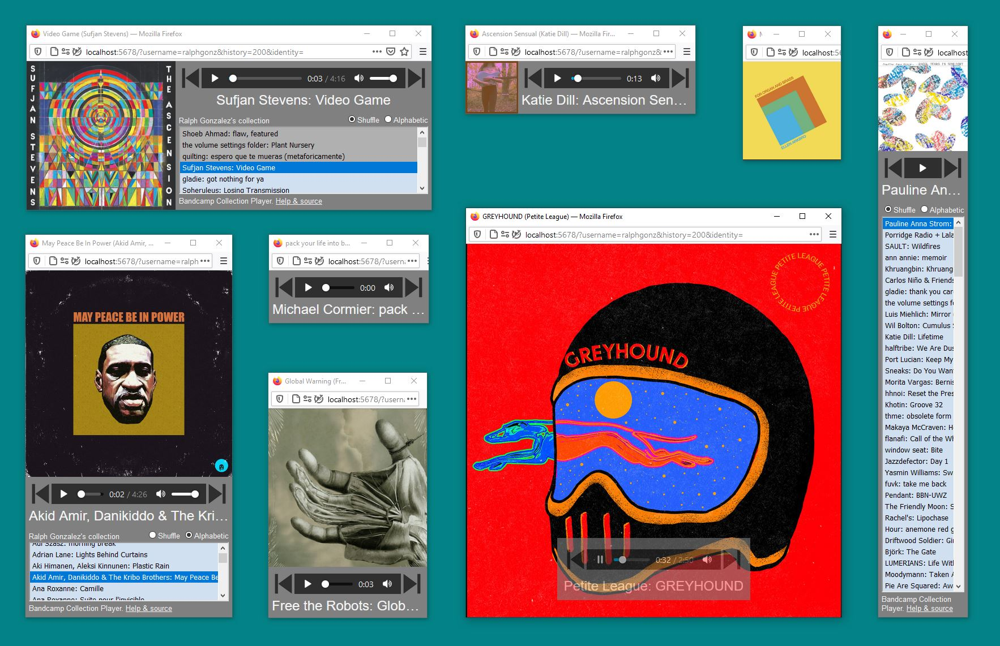

_BCRadio is a web app to shuffle-play your Bandcamp collection and share playlists._ 

[On the air live.](http://bcradio.muskratworks.com)

[[_TOC_]]

## Usage

Fill in your info:
* Bandcamp username (this can be found in Settings > Fan > Username, and is also visible in your fan URL)
* Number of additional (beyond the first 20) recent purchases to load
* Optional: copy/paste your [identity cookie](#understanding-identity-cookies) 
* Press `Enter` and wait for your library to load.
* If you're using a desktop computer, open the player tab as a new window to explore the different layouts available. Try making the window full-screen (F11 in Windows) and tapping the album art to showcase it.



### Controls

* Press icons to Pause, Play, and go to Previous or Next tracks
* The 'X' icon will mark an album to be skipped permanently on this browser. (This does not remove the album from your Bandcamp collection.)
   * You can un-skip the album by selecting a track in the track list and clicking 'X' again
* The up-arrow icon will mark an album to be added to a [Playlist](#playlists)
* Click a track in the track list to skip directly to that track
* The track list may be sorted randomly (Shuffle) or alphabetically
* Click the track name to open its Bandcamp page in a new tab
* Click the album art to toggle stretching it to fill the window...
   * But clicking on the lower third of the album art image replicates Previous/Pause/Next controls

### Playlists

You can create and share playlists made up of albums in your collection:

* Start a BCRadio session without using the [identity cookie](#understanding-identity-cookies) feature if you plan on sharing the playlist
   * Shareable playlists are limited to a single "featured track" of each album
* Click the green up-arrow icon to add the current album to the playlist
   * A second click will remove the album from the playlist
* Repeat with as many albums as you like
* Click the external-link icon at the top of the collection list to open the playlist in a new BCRadio session in another tab
* Copy the address from the new tab to share with your friends

This feature is intended to help raise awareness of the great music available on Bandcamp. Please encourage
your friends to sign up and start their own collections!

### Understanding Identity Cookies

BCRadio cannot sign into your Bandcamp account directly. By default it only loads the publicly-available "featured" track for each album, and is limited to mp3-128k streaming resolution. By providing your Bandcamp identity cookie to BCRadio, you enable loading all your 
purchased tracks rather than just the "featured" tracks, and also enable mp3-V0 sound quality.

You can copy your identity cookie by visiting the Bandcamp website in another tab and using your browser's developer tools.

* _Unfortunately many mobile devices do not support this feature_

## Limitations

* This app is not affiliated with Bandcamp in any way
* The code does not use a published API and may break in the future

-------------
## Development

Install Ruby packages
```
gem install http
````

Start local server on default port 5678
```
ruby bcradio.rb
```

Navigate to `http://localhost:5678`. 
